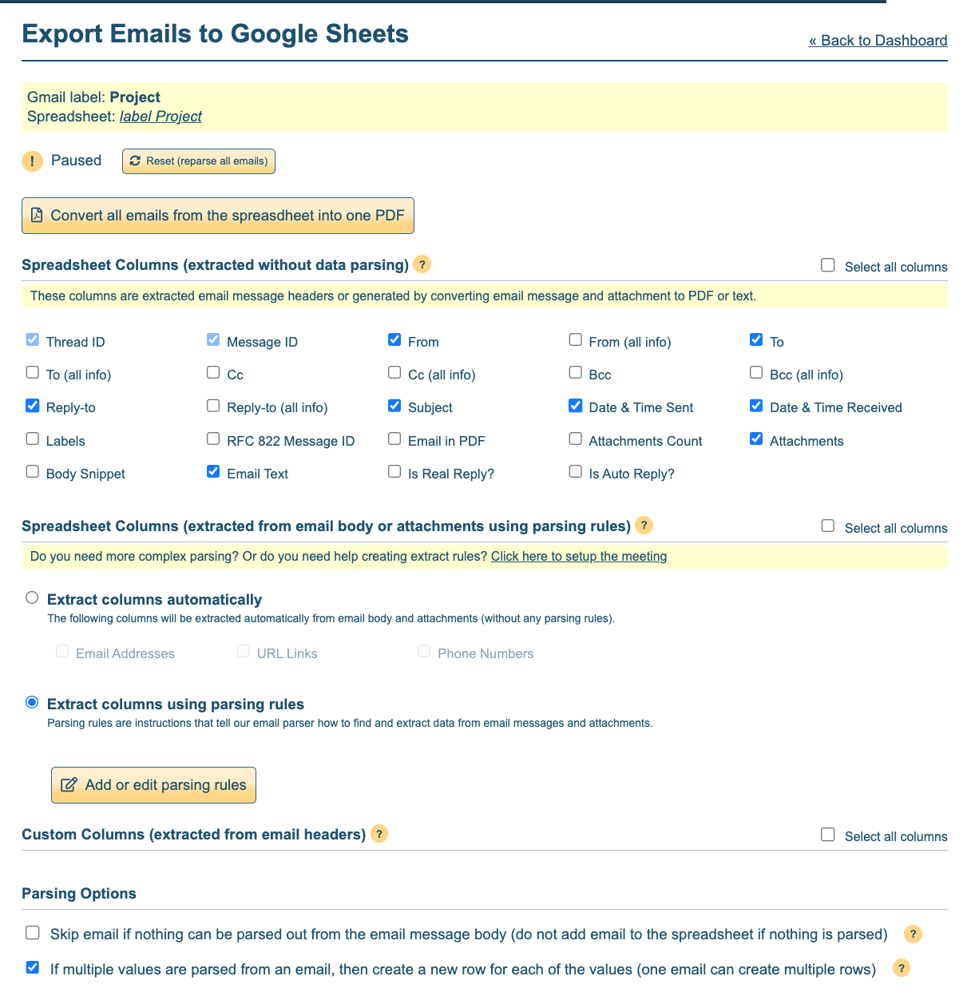

# Forward specific Email from Gmail to Slack automatically

An AppsScript project to forward emails with specific word in the subject line or body from Gmail to a Slack channel

## Prerequisites

- Gmail address needs to be added to target Slack
- You need to [set up an incoming webhook on Slack](https://api.slack.com/messaging/webhooks#getting_started) for that Gmail address & the target Slack channel

## Setup

1. In the Gmail account which should forward the emails, set up a label for conversations that should be forwarded, ie "Project"
2. Create a filter rule to apply that label automatically to incoming messages (ie if there's the word "project" in the subject line or message body)
3. Connect the application "Export Emails to Google Sheets" by [CloudHQ](https://www.cloudhq.net/) to that Gmail account, use the following settings
   
4. In the spreadsheet you set up during the last step, add Apps Script configured with your settings (see comments in the script)
5. Set up a trigger, easiest is time-based, ie hourly/daily etc

## Script functions

The script does 4 things:

1. Get data that hasn't been forwarded yet from Spreadsheet
2. Transform data into Slack format (blocks)
3. Send alert to Slack
4. Update data rows: mark as forwarded to avoid sending duplicates